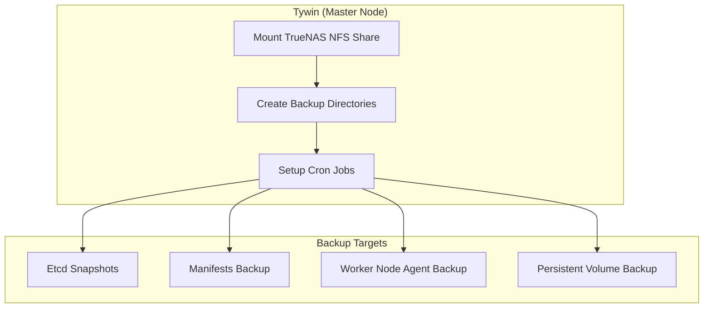

## 8️⃣ Ansible Playbook: Automating K3s Backups 🛠️

This section explains the **Ansible playbook** used to automate K3s backups to a TrueNAS NFS share. Using Ansible ensures that **all steps are reproducible, consistent, and maintainable**, without relying on manual commands on each node.

---

### Why Use an Ansible Playbook?

- **Consistency:** Ensures the same backup setup across all K3s nodes.  
- **Automation:** Cron jobs, directory creation, and NFS mounting happen automatically.  
- **Idempotency:** Running the playbook multiple times does not break existing setup.  
- **Centralized control:** Only Tywin (the master node) handles NFS mounting and backup orchestration, avoiding conflicts.  
- **Auditability:** All tasks are documented in YAML, easy to review or version in GitHub.

---

### Overview of the Playbook

```yaml
---
- name: Setup K3s backups to TrueNAS
  hosts: k3s_all
  become: yes
  vars:
    truenas_nfs: "10.0.10.8:/mnt/tera/backups/k3s"
    mount_point: "/mnt/backup-tera"

    k3s_snapshots_dir: "/var/lib/rancher/k3s/server/db/snapshots"
    k3s_manifests_dir: "{{ mount_point }}/manifests"
    k3s_nodes_dir: "{{ mount_point }}/nodes"
    k3s_pv_backup: "{{ mount_point }}/pv"

    cron_jobs:
      - name: "Daily etcd snapshot"
        minute: "0"
        hour: "2"
        job: "k3s etcd-snapshot save --name snapshot-$(date +\\%F_\\%H-\\%M-\\%S).db && rsync -avz {{ k3s_snapshots_dir }}/ {{ mount_point }}/snapshots/"
      - name: "Daily manifests backup"
        minute: "0"
        hour: "3"
        job: "kubectl get all --all-namespaces -o yaml > {{ k3s_manifests_dir }}/k3s-all-resources-$(date +\\%F).yaml"
      - name: "Daily worker agent backup (Tywin only)"
        minute: "0"
        hour: "4"
        job: "rsync -avz jaime@10.0.10.12:/var/lib/rancher/k3s/agent {{ k3s_nodes_dir }}/jaime/ && rsync -avz tyrion@10.0.10.13:/var/lib/rancher/k3s/agent {{ k3s_nodes_dir }}/tyrion/"
      - name: "Daily PV backup"
        minute: "0"
        hour: "5"
        job: "rsync -avz /mnt/nfs-pv/ {{ k3s_pv_backup }}/"

  tasks:
    - name: Mount TrueNAS NFS share (Tywin only)
      mount:
        path: "{{ mount_point }}"
        src: "{{ truenas_nfs }}"
        fstype: nfs
        opts: defaults,_netdev
        state: mounted
      when: inventory_hostname == "tywin"

    - name: Ensure backup directories exist (Tywin only)
      file:
        path: "{{ item }}"
        state: directory
        mode: '0755'
      loop:
        - "{{ mount_point }}/snapshots"
        - "{{ k3s_manifests_dir }}"
        - "{{ k3s_nodes_dir }}/jaime"
        - "{{ k3s_nodes_dir }}/tyrion"
        - "{{ k3s_pv_backup }}"
      when: inventory_hostname == "tywin"

    - name: Setup cron jobs for backups (Tywin only)
      cron:
        name: "{{ item.name }}"
        minute: "{{ item.minute }}"
        hour: "{{ item.hour }}"
        job: "{{ item.job }}"
        user: root
      loop: "{{ cron_jobs }}"
      when: inventory_hostname == "tywin"
```

## 9️⃣ Ansible Playbook Flow Diagram 🌐

This diagram visualizes how the Ansible playbook automates K3s backups:


