## K3s Cluster Installation Playbook Overview 🚀

This Ansible playbook automates the **full setup of a K3s cluster**, including master and worker nodes, kubeconfig setup, Kubernetes Dashboard installation, and a post-install bootstrap of essential services.

---

### 1️⃣ Purpose of the Playbook

- **Automated K3s installation**: Ensures master and worker nodes are set up consistently.
- **Repeatable deployments**: Can run multiple times on new clusters or nodes without manual steps.
- **Centralized configuration**: Handles token distribution, kubeconfig retrieval, and path adjustments.
- **Service bootstrap**: Integrates the `bootstrap-k3s.sh` script to automatically install cert-manager, MetalLB, Traefik, and ArgoCD.

---

### 2️⃣ Master Node Setup

1. **Install K3s server**  
   - Uses `curl | sh` with TLS SAN and disables default Traefik and ServiceLB.  
   - Writes kubeconfig with proper permissions.

2. **Retrieve and save node token**  
   - Stores token locally for worker nodes to join the cluster.

---

### 3️⃣ Worker Nodes Setup

1. **Read master token**  
   - Slurps the token from the control node via Ansible for secure distribution.

2. **Install K3s agent**  
   - Connects each worker node to the master using the retrieved token.

---

### 4️⃣ Kubeconfig Setup on Controller

- Fetches the master kubeconfig to the Ansible controller.
- Adjusts `localhost` to the master IP.
- Installs `kubectl` for management on ARM64 or non-root environments.
- Ensures local binary path is permanently in the user’s `$PATH`.

---

### 5️⃣ Kubernetes Dashboard Installation

- Adds Helm repository and updates indexes.
- Deploys Dashboard with ingress enabled and TLS configuration.
- Creates an admin service account with cluster-admin permissions.

---

### 6️⃣ Bootstrap Script Integration

- The playbook **triggers the `bootstrap-k3s.sh` script** after the cluster is ready.
- Automates installation of:

  1. **Cert-Manager** – for TLS certificates and ingress security.  
  2. **MetalLB** – provides a bare-metal load balancer for services.  
  3. **Traefik** – acts as the Ingress controller.  
  4. **ArgoCD** – enables GitOps workflows for app deployments.

**Why include the bootstrap script?**

- Makes the cluster setup **fully automated and repeatable**.
- Ensures services are installed **in a reliable order**.
- Reduces **human error** and manual intervention.
- Keeps infrastructure **consistent across environments**.

---

✅ **Outcome:**  
Running this playbook fully provisions a K3s cluster with master and workers, configures access, deploys the Kubernetes Dashboard, and sets up essential cluster services automatically, ready for production or development use.

## K3s Playbook & Bootstrap Flow 🖥️🌐

```mermaid
flowchart TD
    %% Ansible Controller
    subgraph Ansible_Controller[💻 Ansible Controller / localhost]
        A[📄 Run Playbook: install-k3s.yml]
    end

    %% Master Node
    subgraph Master[🖥️ Master Node: 10.0.10.11]
        B[⚡ Install K3s Server]
        C[🔑 Generate Node Token]
        D[📝 Provide kubeconfig]
    end

    %% Worker Nodes
    subgraph Workers[👷 Worker Nodes]
        E[📥 Read Master Token]
        F[🤖 Install K3s Agent]
    end

    %% Controller Local Config
    subgraph Controller_Kubectl[🛠️ Controller Local Setup]
        G[📂 Fetch kubeconfig from Master]
        H[📦 Install kubectl & Setup PATH]
    end

    %% Kubernetes Dashboard
    subgraph Dashboard[📊 Kubernetes Dashboard]
        I[🚀 Install via Helm]
        J[🛡️ Create Admin SA & ClusterRoleBinding]
    end

    %% Bootstrap Script
    subgraph Bootstrap[⚙️ Bootstrap Script: bootstrap-k3s.sh]
        K[🔐 Cert-Manager]
        L[📡 MetalLB]
        M[🌐 Traefik]
        N[🎯 ArgoCD]
    end

    %% Connections
    A --> B
    B --> C
    C --> E
    E --> F
    B --> D
    D --> G
    G --> H
    A --> I
    I --> J
    A --> K
    K --> L
    L --> M
    M --> N
```

### How It Works:

1. **Playbook runs from the Ansible controller**.
2. **Master node is installed first**, generates node token and kubeconfig.
3. **Worker nodes read token** and join cluster as agents.
4. **Controller fetches kubeconfig** and installs `kubectl`.
5. **Dashboard is deployed** via Helm with ingress & TLS.
6. **Bootstrap script executes** to install Cert-Manager, MetalLB, Traefik, and ArgoCD.

This visual shows the **sequential orchestration** of the playbook and the bootstrap script, making it easy to understand for readers on GitHub.  

